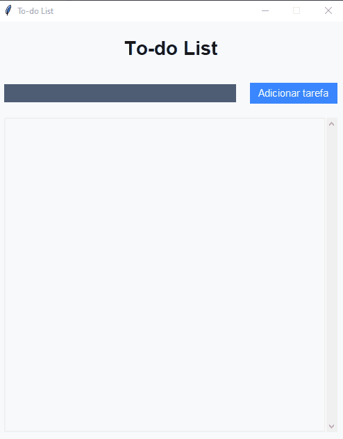

# ✅ To-do List com Tkinter


Uma aplicação gráfica de **lista de tarefas (To-do List)** desenvolvida em Python utilizando a biblioteca **Tkinter**. O projeto oferece uma interface limpa, intuitiva e funcional para te ajudar a organizar o seu dia a dia com eficiência.

---

## 🖼️ Preview



---

## ✨ Funcionalidades

- ✅ Adicionar novas tarefas
- 📝 Editar tarefas existentes
- ☑️ Marcar tarefas como concluídas (com texto riscado)
- 🗑️ Remover tarefas
- 🔃 Interface com **scroll automático**
- 🎨 Estilo visual moderno com paleta de cores personalizada

---

## 🎨 Paleta de Cores

| Nome                  | Código   | Uso                          |
|-----------------------|----------|-------------------------------|
| Fundo claro           | `#F7F9FC` | Janela principal              |
| Texto principal       | `#1A1A1A` | Títulos e tarefas             |
| Texto secundário      | `#4F5D75` | Campo de entrada              |
| Ação principal        | `#3A86FF` | Botões de ação (ex: adicionar)|
| Concluído / Sucesso   | `#06D6A0` | Fundo da lista (efeito visual)|

---

## 🚀 Como executar

1. **Clone o repositório:**
   ```bash
   git clone https://github.com/marcosAugustoo/to-do-list.git
